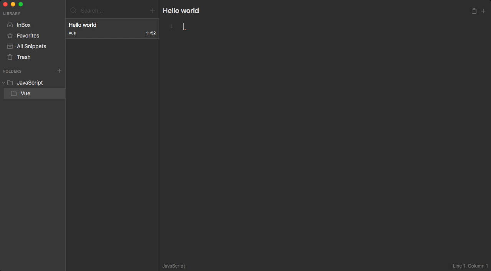

# massCode

A free and open source code snippets manager for developers.

> Work in progress

If you like the project, you can support it by becoming a backer or sponsor:

- <a href="https://www.patreon.com/antonreshetov" target="_blank">Become a backer or sponsor on Patreon</a>.
- <a href="https://paypal.me/antonreshetov" target="_blank">One-time donation via PayPal</a>.

  

  

  <strong>Built with Electron, Vue & Monaco editor.</strong>
   
  Inspired by applications like SnippetsLab and Quiver.

