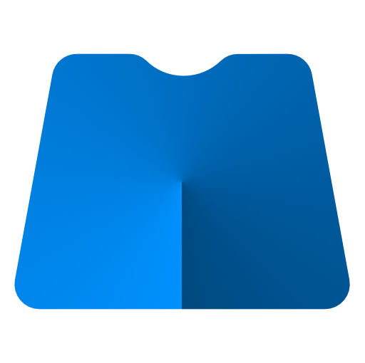

# massCode

> The second version in beta stage is available in the [v2](https://github.com/antonreshetov/massCode/tree/v2) branch, builds are available in the [releases](https://github.com/antonreshetov/massCode/releases)

A free and open source code snippets manager for developers.

<p align="center">
  
</p>
<p align="center">
  
  
  
  
</p>
<p align="center">
  
</p>
<p align="center">
  <strong>Built with Electron, Vue & Monaco editor.</strong>
  <br>
  Inspired by applications like SnippetsLab and Quiver.
</p>
<p align="center">
  <a href="https://masscode.io">Official Website</a> | <a href="https://masscode.io/documentation">Documentation</a> | <a href="https://masscode.io/releases">Change Log</a>
</p>

## Supporting

**massCode** is open source project and completely free to use.

However, the amount of effort needed to maintain and develop new features for the project is not sustainable without proper financial backing. You can support massCode development via the following methods:


<div align="center">

[![Donate via Open Collective](https://img.shields.io/badge/donate-open%20collective-blue.svg?style=popout&logo=data:image/svg+xml;base64,PD94bWwgdmVyc2lvbj0iMS4wIiBlbmNvZGluZz0iVVRGLTgiPz48c3ZnIHdpZHRoPSIyNTZweCIgaGVpZ2h0PSIyNTZweCIgdmlld0JveD0iMCAwIDI1NiAyNTYiIHZlcnNpb249IjEuMSIgeG1sbnM9Imh0dHA6Ly93d3cudzMub3JnLzIwMDAvc3ZnIiB4bWxuczp4bGluaz0iaHR0cDovL3d3dy53My5vcmcvMTk5OS94bGluayIgcHJlc2VydmVBc3BlY3RSYXRpbz0ieE1pZFlNaWQiPjxnPjxwYXRoIGQ9Ik0yMDkuNzY1MTQ0LDEyOC4xNDk5NzkgQzIwOS43NjUxNDQsMTQ0LjE2MzMgMjA0Ljg2NDM4MSwxNTkuNDg5ODkgMTk2LjQ5ODc0NywxNzIuNzI1MDcyIEwyMjkuOTQ1Njc1LDIwNi4xNzE5OTkgQzI0Ni42ODIxMDUsMTgzLjg1Njc1OSAyNTUuNzI5MzA3LDE1Ni43MTUxNTIgMjU1LjcyOTMwNywxMjguODIxMTAyIEMyNTUuNzI5MzA3LDk5LjU1Njk5MTcgMjQ1Ljk3NDYwMyw3My4wNzEwMjA3IDIyOS4yNTg5NDQsNTEuNDg1ODEyOCBMMTk2LjQ4MzE0LDg0LjIxNDc5NCBDMjA1LjEyMjU2MSw5Ny4yMjI0NjgzIDIwOS43MzY5MDcsMTEyLjQ4NzgxIDIwOS43NDk1MzcsMTI4LjEwMzE1NiBMMjA5Ljc2NTE0NCwxMjguMTQ5OTc5IFoiIGZpbGw9IiNCOEQzRjQiPjwvcGF0aD48cGF0aCBkPSJNMTI3LjUxMzQ4NCwyMTAuMzU0ODE2IEM4Mi4xNDYwODcyLDIxMC4yNjg5NTggNDUuMzg3NTA5NCwxNzMuNTE3MzU4IDQ1LjI5MzAzOTMsMTI4LjE0OTk3OSBDNDUuMzYxNzUwMiw4Mi43NjQzMTM4IDgyLjEyNzg0ODcsNDUuOTg0MjU3IDEyNy41MTM0ODQsNDUuODk4MzE4NiBDMTQ0LjI0NDc1Miw0NS44OTgzMTg2IDE1OS41NzEzNDIsNTAuNzk5MDgxNyAxNzIuMTE5NzkyLDU5LjE2NDcxNTQgTDIwNC44NjQzODEsMjYuMzg4OTExNiBDMTgyLjU0MzY1LDkuNjY2NjUxMjkgMTU1LjQwMzQyOSwwLjYzMDg2MzI5OCAxMjcuNTEzNDg0LDAuNjM2NDk0NDAzIEM1Ny4xMjM1NDM3LDAuNjM2NDk0NDAzIDAsNTcuNzYwMDM4MSAwLDEyOC4xNDk5NzkgQzAsMTk4LjUwODcwNCA1Ny4xMjM1NDM3LDI1NS42NjM0NjMgMTI3LjUxMzQ4NCwyNTUuNjYzNDYzIEMxNTUuNTM3MzUyLDI1NS43NDA4NzYgMTgyLjc3NTk4OSwyNDYuNDA4NTEgMjA0Ljg2NDM4MSwyMjkuMTYxODg0IEwxNzEuNDE3NDU0LDE5NS43MzA1NjQgQzE1OS41NTU3MzQsMjA1LjQ4NTI2OCAxNDQuMjYwMzU5LDIxMC4zNTQ4MTYgMTI3LjUxMzQ4NCwyMTAuMzU0ODE2IEwxMjcuNTEzNDg0LDIxMC4zNTQ4MTYgWiIgZmlsbD0iIzdGQURGMiI+PC9wYXRoPjwvZz48L3N2Zz4=)](https://opencollective.com/masscode)
[](https://www.patreon.com/antonreshetov)
[](https://paypal.me/antonreshetov)
[](https://blockchain.com/btc/payment_request?address=1GnNU7UGrXyKx5Zd3uDfhCLL716AYBJwAJ&amount=0.00010450&message=Contribution%20to%20massCode)

</div>

## Overview

The goal of creating this application was mostly my own growth as a developer. Also, I wanted this project to absorb the best of such applications already on the market (both free and paid). At the same time, I wanted this project to be an open source project.

massCode allows you to organize snippets using multi-level folders as well as tags. Each snippet has fragments - tabs, which gives even greater level of organization

A snippets manager must not only provide organization of snippets but also have a good code editor. That's why under the hood of massCode there's [Monaco editor](https://microsoft.github.io/monaco-editor/). Monaco is a modern code editor from Microsoft which is used in one of the most popular editor [VS Code](https://code.visualstudio.com/). The editor provides IntelliSense, validation for TypeScript, JavaScript, CSS, LESS, SCSS, JSON, HTML. It's also added a super productive [Emmet](https://emmet.io/) and [Prettier](https://prettier.io/) to code formatter.

## Development

```bash
# install dependencies
yarn
# serve with hot reload
yarn dev
```

## Building

```bash
## build application for production
yarn build
```

## License

[AGPL-3.0](https://github.com/antonreshetov/massCode/blob/master/LICENSE)

Copyright (c) 2019-present, Anton Reshetov.